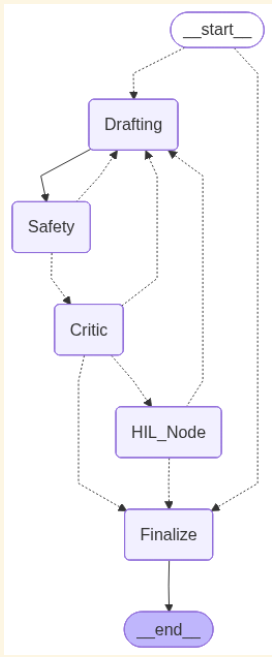

# CBT Review Board

A **stateful, multi-agent CBT exercise generation system** built with **LangGraph**, **FastAPI**, and **SQLite**, designed to generate **safe, empathetic, NHS-aligned CBT exercises** with:

- explicit agent collaboration (blackboard)
- persistent memory and crash recovery
- human approval mechanism
- Claude Desktop (MCP) integration

## Installation (Run all commands step by step)

```bash
python -m venv venv    // create virtual env
.\venv\Scripts\activate   // activate virtual env
pip install -r requirements.txt   // install dependencies
```

### Install NLTK Dependencies (used for sentiment analysis)

```bash
python -c "import nltk; nltk.download('punkt')"
python -c "import nltk; nltk.download('vader_lexicon')"
```

### Create a `.env` file in the project root folder and add these configuratons:

```bash
OPENAI_API_KEY="<YOUR-OPEAI-API-KEY>"
GROQ_API_KEY="<YOUR-GROQ-API-KEY>"


### START SERVER

```

uvicorn api_server:app_api --reload

```


### Server runs locally at:

```

http://127.0.0.1:8000

```

---

## Agent Architecture & Flow

<p align="center">
  
</p>

### High-Level Flow

```

START
↓
Drafting Agent
↓
Safety Agent
↓
Clinical Critic Agent
↓
Human-in-the-Loop (HIL)
↓
Finalize
↓
END

```

Routing decisions are deterministic and based on:

* safety score thresholds
* empathy metrics
* unresolved blackboard notes
* explicit human decisions
* iteration limits

---

## Agent Responsibilities

### Drafting Agent

* Generates or revises CBT exercises
* Reads:

  * user intent
  * blackboard notes (agent scratchpads)
  * intent signals from other agents
  * human revision instructions
* Produces:

  * `current_draft`
  * versioned `draft_history`
* Explicitly **resolves blackboard notes** it addresses

---

### Safety Agent (NHS-Aligned)

* Reviews drafts for:

  * unsafe advice
  * clinical overreach
  * medical instructions
* Uses:

  * **NHS Talking Therapies Manual** via retriever tool
* Produces:

  * `SafetyReport`
  * `safety_metric`
  * **blocking blackboard notes** when violations exist

> The agent enforces strict non-clinical framing and never provides diagnosis or treatment advice.

---

### Clinical Critic Agent

* Evaluates:

  * empathy
  * tone
  * CBT structure
* Uses:

  * NHS CBT standards
  * NLTK VADER sentiment analysis
* Produces:

  * `CriticNotes`
  * `empathy_metric`
  * warning-level blackboard notes when tone/empathy is weak

---

### Human-in-the-Loop (HIL)

* Halts graph execution
* Awaits human decision:

  * **Approve** → Finalize
  * **Reject** → Revision loop
* Human decisions are persisted and replayable

---

### Finalize Agent

* Finalizes approved CBT output
* Produces:

  * final draft
  * safety & empathy scores
  * iteration count
  * safety report

---

## NHS Tool Integration

The system integrates the **NHS Talking Therapies Manual** added at:

```

data/nhs_talking_therapies_manual_v7.1.pdf (downloaded on first run)
graph/tools/nhs_cbt_manual_retriever.py (retriever tool)

```

* Used by Safety and Critic agents
* Ensures:

  * stepped-care boundaries
  * non-directive language
  * no medical or clinical advice
* Manual content is **referenced, never quoted verbatim**

---

## Deep State, Scratchpads & Persistence

### Blackboard (Agent Scratchpads)

A shared **blackboard** exists inside `ProjectState`:

* `blackboard_notes`
* `intent_signals`

Properties:

* additive (never overwritten)
* agent-scoped
* persisted across iterations
* explicitly resolved by the Drafting agent

---

### Versioning

* Every revision is tracked:

  * `current_draft`
  * `draft_history[]`
* Enables:

  * draft comparison
  * audit trails
  * loop debugging

---

### Metadata

Each session tracks:

* iteration count
* safety score
* empathy score
* active node
* human decision state

These metrics drive routing and UI status.

---

### Persistence & Memory

#### Checkpointing

* Every graph step is checkpointed to **SQLite**
* Uses:

  * `SqliteSaver`
  * WAL mode (`PRAGMA journal_mode = WAL`)
* Guarantees:

  * crash-safe recovery
  * resume from exact last state

#### History

The database retains:

* all drafts
* all metrics
* all blackboard notes
* all human decisions

This enables audits, replay, and debugging.

---

## Enabling the MCP Server in Claude Desktop (Step-by-Step)

This project exposes an **MCP server** so **Claude Desktop** can directly interact with the CBT system.

### Prerequisites

* Python venv created and dependencies installed
* Project runs without errors
* Claude Desktop installed (latest version)


### Step 1: Locate Claude MCP Config File (Windows)

```

C:\Users\<YOUR_USERNAME>\.claude\config.json

````

Create the file if it does not exist.


### Step 2: Add MCP Server Configuration

Use **absolute paths**:

```json
{
  "mcpServers": {
    "CBT SERVER": {
      "command": "C:\\Users\\abdul_tyym3hn\\Downloads\\cbt-review-board\\venv\\Scripts\\python.exe",
      "args": [
        "C:\\Users\\abdul_tyym3hn\\Downloads\\cbt-review-board\\mcp_server.py"
      ]
    }
  }
}
````

**Important**

- Paths must be absolute
- Use double backslashes (`\\`)
- Python must point to the project virtual environment

---

### Step 3: Restart Claude Desktop

1. Fully close Claude Desktop
2. Reopen Claude Desktop
3. MCP server starts automatically

---

### Step 4: Verify MCP Server

- `mcp_server.py` loads LangGraph + SQLite
- No errors should appear in Claude
- Claude can now invoke CBT workflows

Example prompt:

> “Start a CBT session for managing procrastination.”

---

## API Endpoints

Base URL:

```
http://127.0.0.1:8000
```

### API Reference

| Method | Endpoint                           | Description             | Sample Input                                                                     |
| ------ | ---------------------------------- | ----------------------- | -------------------------------------------------------------------------------- |
| POST   | `/start_session`                   | Start a new CBT session | `{ "user_prompt": "...", "model_choice": "openai" }`                             |
| POST   | `/resume_session`                  | Resume halted session   | `{ "thread_id": "...", "human_decision": "Reject", "suggested_content": "..." }` |
| GET    | `/stream_session_info`             | Real-time SSE updates   | `?thread_id=UUID`                                                                |
| GET    | `/checkpoints/{checkpoint_id}`     | Fetch single checkpoint | URL param                                                                        |
| GET    | `/threads/{thread_id}/checkpoints` | Fetch all checkpoints   | URL param                                                                        |

You can use the url `https://documenter.getpostman.com/view/1786186/2sB3dTs7qC` to import the postman collection on your desktop and use the above APIs.

---

## Project Structure (Key Files)

```
graph/
  agents.py            # Agent logic
  supervisor.py        # LangGraph routing & persistence
  state.py             # ProjectState + blackboard
  tools/
    nhs_cbt_manual_retriever.py           # NHS retriever
api_server.py               # FastAPI backend
mcp_server.py               # Claude MCP server
assets/images/              # Architecture diagrams
cbt_review_board.sqlite     # local db for Persistence & Memory
```

---

## Features of this graph

- NHS-aligned by design
- Deterministic and inspectable agent decisions
- Human accountability built-in
- Crash-safe persistence
- Claude Desktop MCP compatible
- Production-grade LangGraph usage

---
